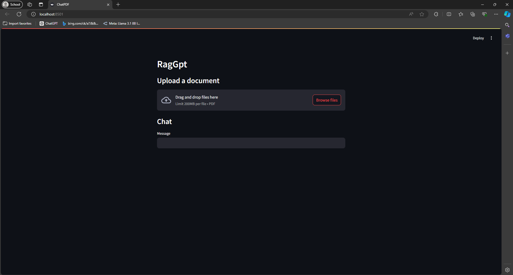
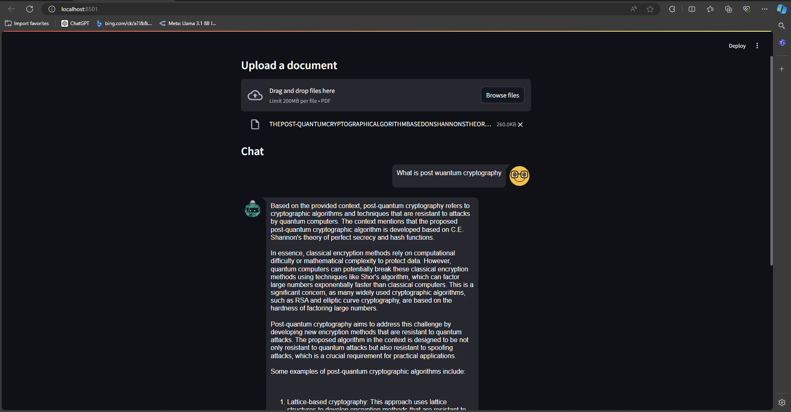

# RagGpt: A Simple PDF Q&A Application

RagGpt is a local application that allows users to upload PDF documents and ask questions about their content using a user-friendly interface. Built on the RAG (Retrieval Augmented Generation) framework, this project utilizes **Langchain**, **Ollama**, and **Streamlit** to deliver a powerful yet straightforward experience while ensuring data privacy and minimizing token costs.


## Sneak Peak



## Table of Contents

- [Features](#features)
- [Tech Stack](#tech-stack)
- [Setup Instructions](#setup-instructions)
- [How to Use](#how-to-use)
- [Enhancements](#enhancements)
- [License](#license)

## Features

- Upload PDF documents and interact with their content.
- Ask questions and receive concise answers generated by an LLM.
- Local execution for enhanced data privacy.
- Simple UI for easy interaction.

## Tech Stack

- **LLM Server**: [Ollama](https://ollama.ai) (llama3 model)
- **RAG Framework**: [Langchain](https://langchain.com)
- **Vector Storage**: [Chroma](https://chroma.io)
- **User Interface**: [Streamlit](https://streamlit.io)

## Setup Instructions

Follow these steps to set up and run RagGpt on your local machine:

### 1. Install Ollama

- Visit [ollama.ai](https://ollama.ai) and download the appropriate app for your operating system.
- Open your terminal and run the following command to pull the Mistral-7B model:

```bash
ollama pull llama3
```
Check if the model was pulled correctly:

```bash
ollama list
```

If the LLM server is not running, initiate it with:

```bash
ollama serve
```
### 2. Install Dependencies
Ensure you have Python installed, then install Streamlit and Langchain:

```bash
pip install streamlit langchain langchain-community
```
### 3. Run the Application
Clone the project repository, navigate to the project directory, and run the Streamlit application:

```bash
streamlit run Ui.py
```
## How to Use
Upload a PDF Document: Click the "Upload document" button to select a PDF file.
Ask Questions: Use the input field to type your question and press enter.
Receive Answers: The application will retrieve relevant content from the PDF and provide concise answers.